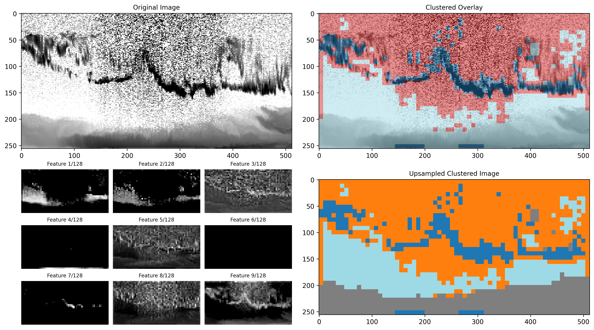

# LIDAR-Based Cloud & Aerosol Detection

This repository contains my Bachelor’s thesis adaptation of the AI-Profiles project by Augustin Mortier (https://github.com/AugustinMortier/ai-profiles/), building on his pretrained, unsupervised autoencoder + KMeans models. It provides Python scripts to process LIDAR data from the E-PROFILE network (https://e-profile.eu) for automated cloud and aerosol detection.

---

## Key Features

* 📊 Extract a 64×3 multilayer time series of the NetCDF’s cloud_base_height (up to three layers per timestep) and derive the model’s cluster_base_height (the cloud-base height predicted by clustering)
* 🌫️ Estimate the maximum aerosol height at each timestep
* 🔍 Visualize results  (cloud vs. no-cloud), 4-cluster, and 8-cluster modes
* 📈 Compute confusion-matrix metrics and summary statistics

---

## Requirements

* **Python** 3.10
* **Poetry** ≥1.5

---

## Installation & Usage


1. You can obtain the code in one of two ways:

### Option A: Clone via Git

```bash
git clone https://github.com/ramgaji/TFG-LIDAR-AEROSOLES.git
cd TFG-LIDAR-AEROSOLES

 ```
### Option B: Download ZIP
Go to the GitHub page:
```bash
https://github.com/ramgaji/TFG-LIDAR-NUBES-AEROSOLES
 ```
Click Code → Download ZIP

Unzip and navigate into the folder:
```bash
cd path/to/TFG-LIDAR-NUBES-AEROSOLES
```
2. Install dependencies with Poetry:

   ```bash
   poetry install
   ```


3. Run the desired script using Poetry:

   * **Multilayer cloud-base series (64×3):**

     ```bash
     poetry run python dec/nubestxt.py
     ```

   * **Aerosol maximum height series:**

     ```bash
     poetry run python dec/aerosoltxt.py
     ```

   * **Binary classification (cloud vs. no-cloud) or k=4 clustering (change it manually):**

     > Edit the script to select k=2 or k=4.

     ```bash
     poetry run python dec/raw_cluster_file_bucleplot.py
     ```

   * **Full 8-cluster segmentation (with feature panels):**

     ```bash
     poetry run python dec/raw_cluster_file_bucleplotk=8.py
     ```

   * **Confusion-matrix and statistics:**

     ```bash
     poetry run python dec/estadisticasconfusiones.py
     ```

---

## Example Outputs

To ensure the images render correctly on GitHub, use the following Markdown syntax with the relative `images/` path:

```markdown
<!-- cloud/aerosols LIDAR Profile with Cluster Overlay (2,4-Cluster Mode) -->


<!-- Overlay of Clustered Image (8-Cluster) -->

```

This will display as:


---

## Project Structure

```plaintext
TFG-LIDAR-AEROSOLES/
├── data/                   # LIDAR NetCDF files 
├── images/                 # Generated PNG plots and screenshots
│   ├── L2_0-20008-0-UGR_A20240406_raw.png
│   └── L2_0-20008-0-UGR_A20240101_rawk=8.png
├── salidastxt/             # TXT outputs (time series & statistics)
├── dec/                    # Python scripts
│   ├── nubestxt.py
│   ├── aerosoltxt.py
│   ├── raw_cluster_file_bucleplot.py
│   ├── raw_cluster_file_bucleplotk=8.py
│   └── estadisticasconfusiones.py
├── pyproject.toml          # Poetry configuration
└── LICENSE                 # GNU GPL v3 (inherited from AI-Profiles)
```

---

## License

This project is licensed under the **GNU GPL v3**. See the [LICENSE](LICENSE) file for details.

---

*Developed as part of my Bachelor's thesis.* For more information visit this presentation:
https://docs.google.com/presentation/d/1agoIat3nD25bmnETn-2xXh23LkiUcL00sMcRIG7Ct0Y/edit?usp=sharing


